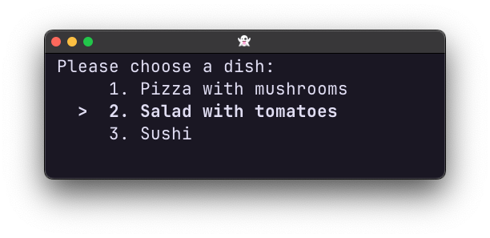
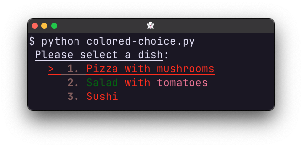
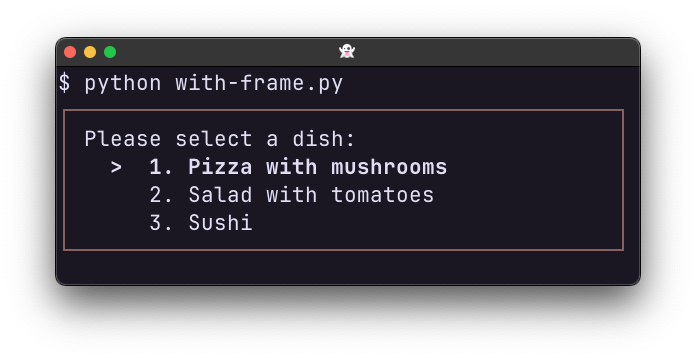
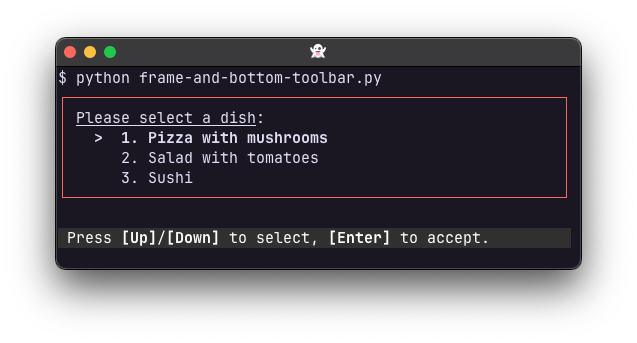

.. _asking_for_input:

Asking for a choice
===================

Similar to how the :func:`~prompt_toolkit.shortcuts.prompt` function allows for
text input, prompt_toolkit has a
:func:`~prompt_toolkit.shortcuts.choice` function to ask for a choice
from a list of options:

.. code:: python

    from prompt_toolkit.shortcuts import choice

    result = choice(
        message="Please choose a dish:",
        options=[
            ("pizza", "Pizza with mushrooms"),
            ("salad", "Salad with tomatoes"),
            ("sushi", "Sushi"),
        ],
        default="salad",
    )
    print(f"You have chosen: {result}")

Coloring the options
--------------------

It is possible to customize the colors and styles. The ``message`` parameter
takes any :ref:`formatted text <formatted_text>`, and the labels (2nd argument
from the options) can be :ref:`formatted text <formatted_text>` as well.
Further, we can pass a :class:`~prompt_toolkit.styles.Style` instance using the
:meth:`~prompt_toolkit.styles.Style.from_dict` function:

.. code:: python

    from prompt_toolkit.formatted_text import HTML
    from prompt_toolkit.shortcuts import choice
    from prompt_toolkit.styles import Style

    style = Style.from_dict(
        {
            "input-selection": "fg:#ff0000",
            "number": "fg:#884444 bold",
            "selected-option": "underline",
        }
    )

    result = choice(
        message=HTML("<u>Please select a dish</u>:"),
        options=[
            ("pizza", "Pizza with mushrooms"),
            (
                "salad",
                HTML("<ansigreen>Salad</ansigreen> with <ansired>tomatoes</ansired>"),
            ),
            ("sushi", "Sushi"),
        ],
        style=style,
    )
    print(f"You have chosen: {result}")

Adding a frame
--------------

The :func:`~prompt_toolkit.shortcuts.choice` function takes a
``show_frame`` argument. When ``True``, the input is displayed within a frame.
It is also possible to pass a :ref:`filter <filters>`, like ``~is_done``, so
that the frame is only displayed when asking for input, but hidden once the
input is accepted.

.. code:: python

    from prompt_toolkit.shortcuts import choice
    from prompt_toolkit.filters import is_done
    from prompt_toolkit.styles import Style

    style = Style.from_dict(
        {
            "frame.border": "#884444",
            "selected-option": "bold",
        }
    )
    result = choice(
        message="Please select a dish:",
        options=[
            ("pizza", "Pizza with mushrooms"),
            ("salad", "Salad with tomatoes"),
            ("sushi", "Sushi"),
        ],
        style=style,
        show_frame=~is_done,
    )
    print(f"You have chosen: {result}")

Adding a bottom toolbar
-----------------------

Adding a bottom toolbar can be done by passing a ``bottom_toolbar`` argument to
:func:`~prompt_toolkit.shortcuts.choice`. This argument can be plain text,
:ref:`formatted text <formatted_text>` or a callable that returns plain or
formatted text.

.. code:: python

    from prompt_toolkit.filters import is_done
    from prompt_toolkit.formatted_text import HTML
    from prompt_toolkit.shortcuts import choice
    from prompt_toolkit.styles import Style

    style = Style.from_dict(
        {
            "frame.border": "#ff4444",
            "selected-option": "bold",
            # ('noreverse' because the default toolbar style uses 'reverse')
            "bottom-toolbar": "#ffffff bg:#333333 noreverse",
        }
    )

    result = choice(
        message=HTML("<u>Please select a dish</u>:"),
        options=[
            ("pizza", "Pizza with mushrooms"),
            ("salad", "Salad with tomatoes"),
            ("sushi", "Sushi"),
        ],
        style=style,
        bottom_toolbar=HTML(
            " Press <b>[Up]</b>/<b>[Down]</b> to select, <b>[Enter]</b> to accept."
        ),
        show_frame=~is_done,
    )
    print(f"You have chosen: {result}")

